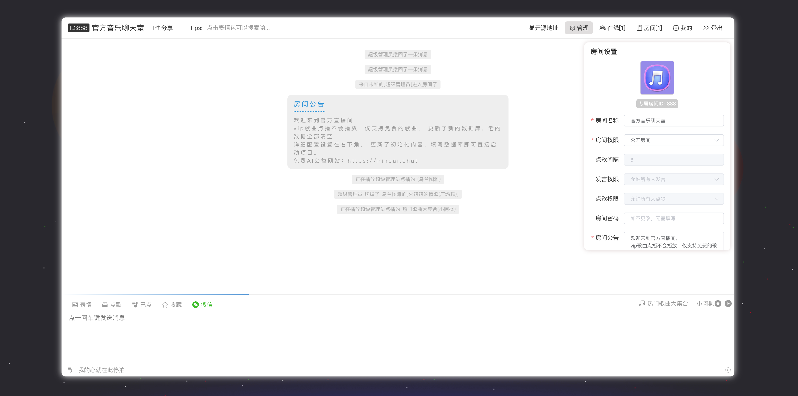

### 2.x版本已经更新

* 前端模块地址： [项目地址](https://github.com/longyanjiang/Nine-chat-frontend.git)
* 项目 [线上体验地址](https://music-chat.mmmss.com/#/http://chat.jiangly.com/#)

## 项目迁移

* 一台云服务器
* 一个mysql服务器即可
* 一个私有文件远程存储的接口
  项目已经提供了测试数据，拉下项目可直接运行，**typeorm**可自动化建表，无需额外操作，修改数据库地址即可快速迁移完成。

### 项目启动

* 项目采用了 orm 操作数据库、所以只需要在`.env 配置文件`中配置上自己的数据库、就会初始化成功、orm会自动创建所需要的数据库
* 如果不想自己建表填入带有root权限的数据库账号密码可以自动化建库，也可以填写场景好的数据库账号密码即可
* 项目提供了一个测试数据库、可以直接使用、账号密码都有配置、可以自行操作即可
* 前端部分  `pnpm install`  `pnpm dev`
* 后端部分 `pnpm install` `pnpm dev` 启动后初次会自动创建 超级管理员（ super  123456 ），自动创建888官方房间， 首次默认会自动往曲库添加部分歌曲，如果想要添加到聊天室，super账号搜索歌曲，收藏就会加入官方聊天室，也可以通过接口`getAlbumList`传入专辑id添加歌曲，也可以在开发环境添加，也可以搜索添加。
* 项目为`DEMO项目`，未配置与验证邮箱，也没有详细配置权限装饰器，仅有基础权限。

### 图片文件上传说明

* 默认文件会上传到public下的files目录，默认basic目录下会有基础图片，所以本地开发环境不会显示图片，使用的是相对路径图片，或者自己拼接，
* 将前端项目打包后的dist文件内容放入public下面，即可只启动后端项目 3000端口即可同时访问前后端，图片即可正常

### 免责声明

平台音乐数据来源于第三方网站，仅供学习交流使用，请勿用于商业用途。

### 更新历史

```html
1.x:
 1、普通文字聊天、粘贴图片发送、在线搜索表情包发送等聊天功能
 2、在线搜索歌曲、点歌、切割、收藏歌曲
 3、歌曲实时播放，所有人共享一个实时歌单、一起听歌
 4、实时修改个人信息资料
 5、支持自定义专属背景
 6、快捷键等待你的探索

2.x: 2022051
 1.新增个人私有房间，支持用户创建自己独立的房间了
 2.新增图片或文件发送，可直接粘贴到输入框即可
 3.支持消息引用，点击引用的消息会自动滚动到指定位置
 4.上拉平滑加载更多[修复1.0]上拉抖动问题
 5.新增消息两分钟内可撤回
 6.划分三级权限 超级管理员>房主>普通用户 支持加密房间
 7.新增夜间主题和透明主题，支持部分快捷操作
 8.新增部分快捷键

更多功能等你来提...
```

## 项目部分截图





### 基础技术栈

* 前端采用 vue + socker-io 未使用ui框架
* 后端采用 nestjs + typeorm + mysql + socket.io

> 佛系更新 有需要请 `issues`提 看到有需要就更新、没有就GG

### 关于更新

详情功能看预览地址，有bug就留言，基础模型功能都有，可以自己二次开发。

有时间也会更新部分功能上去、尽量做到简洁、方便各位移植和部署。

有创意或想法可以提issues，采纳会回复更新。
